# Raffles
A Raffle app. 
Users can create a raffle and pull a winner among the participants.  
Users can join other raffles as a participant.

## Technologies Used
* SwiftUI (https://developer.apple.com/documentation/swiftui)
* Combine (https://firebase.google.com/docs)

| Creating A Raffle | Scrolling to see raffles |
| --- | --- |
|  |  |

| Participating in a raffle | Picking a winner |
| --- | --- |
|  |  |

| Home View Light Mode | Home View Dark Mode |
| --- | --- |
| 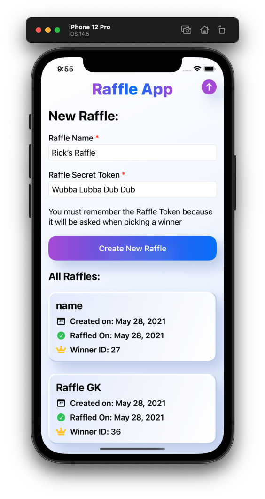 | 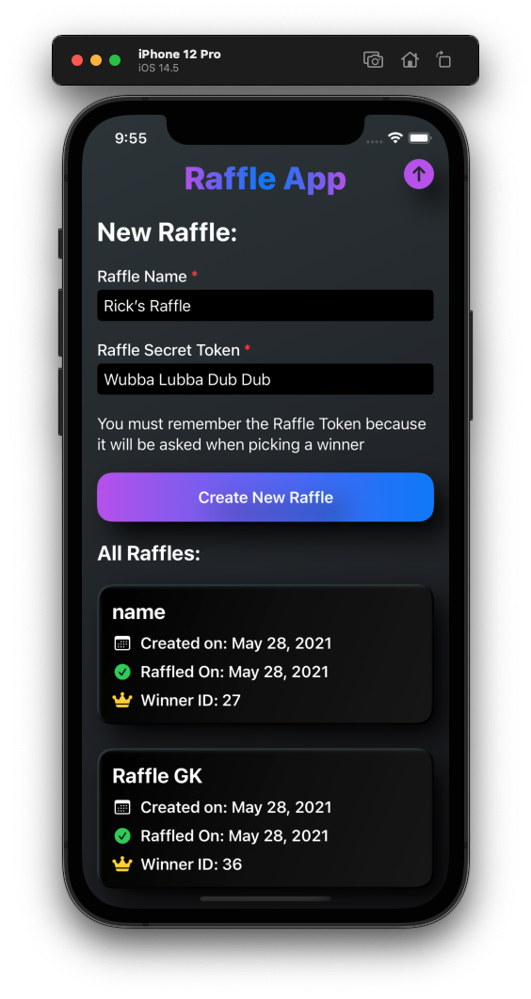 |

| Register Light Mode | Register Dark Mode |
| --- | --- |
| 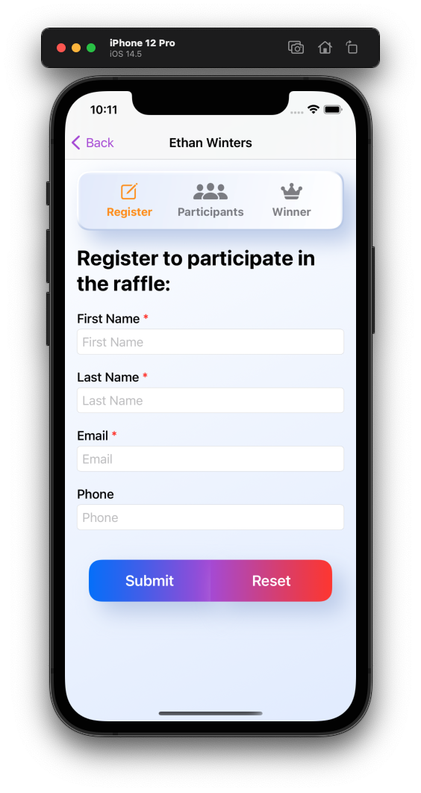 | 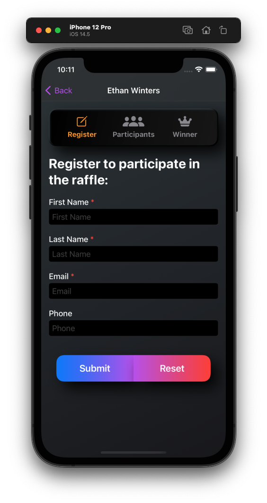 |

| Participants Light Mode | Participants Dark Mode |
| --- | --- |
| 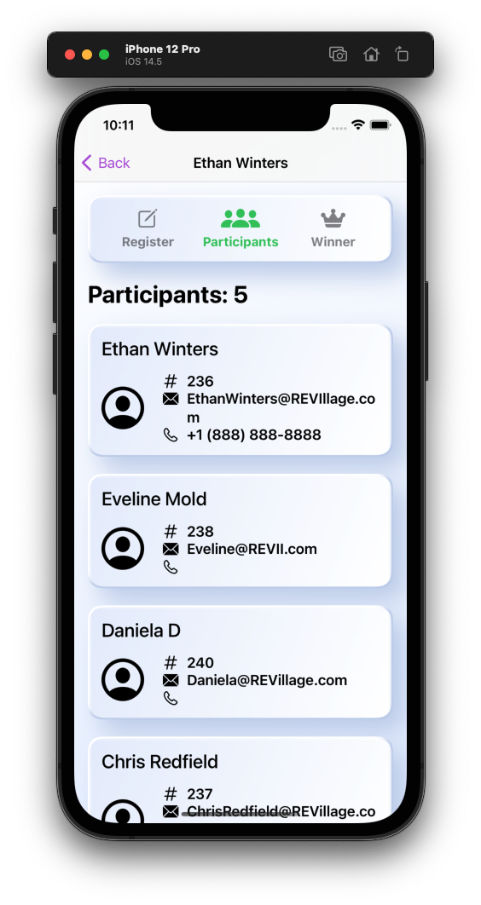 | 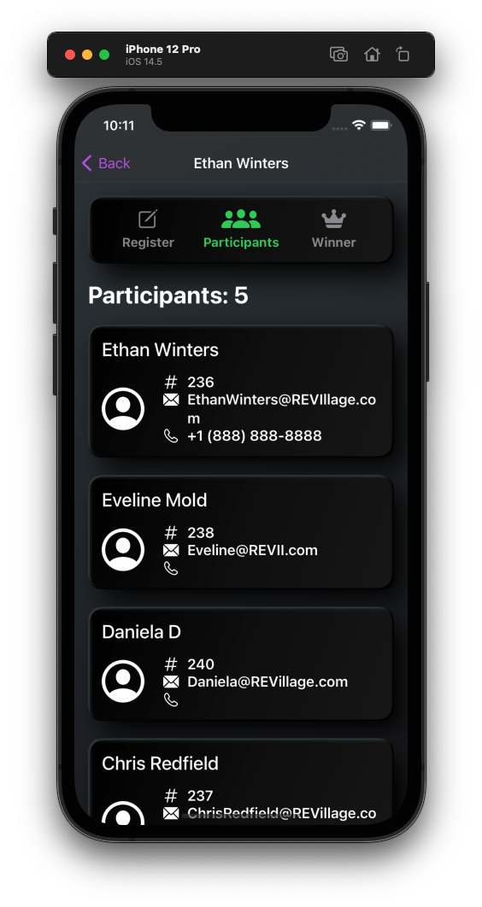 |

| Pick A Winner Light Mode | Pick a Winner Dark Mode |
| --- | --- |
| 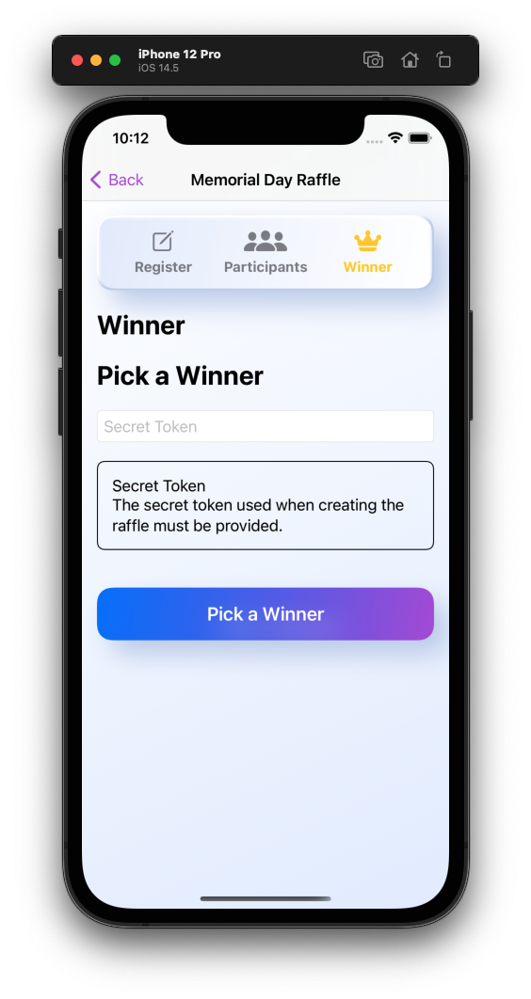 | 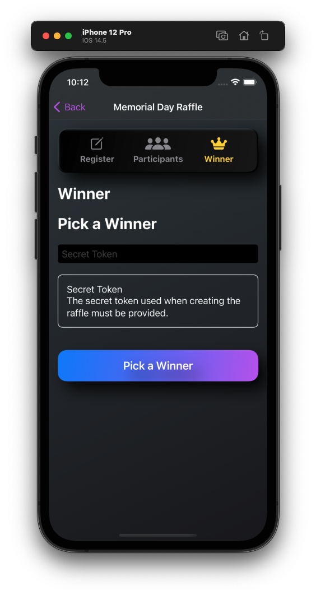 |

| Winner View Light Mode | Winner View Dark Mode |
| --- | --- |
| 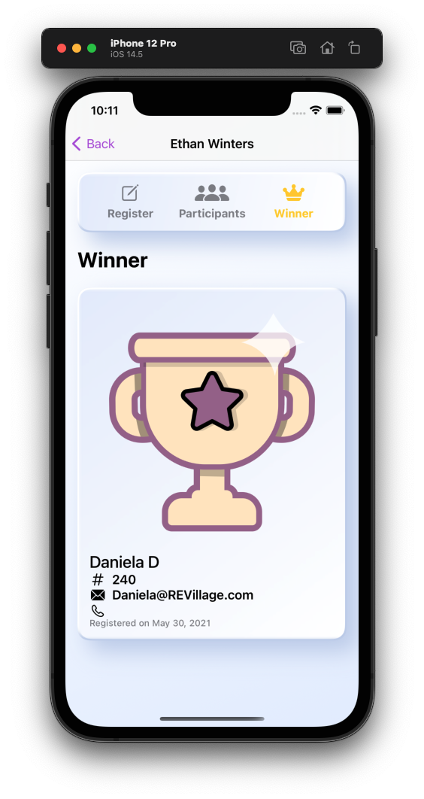 | 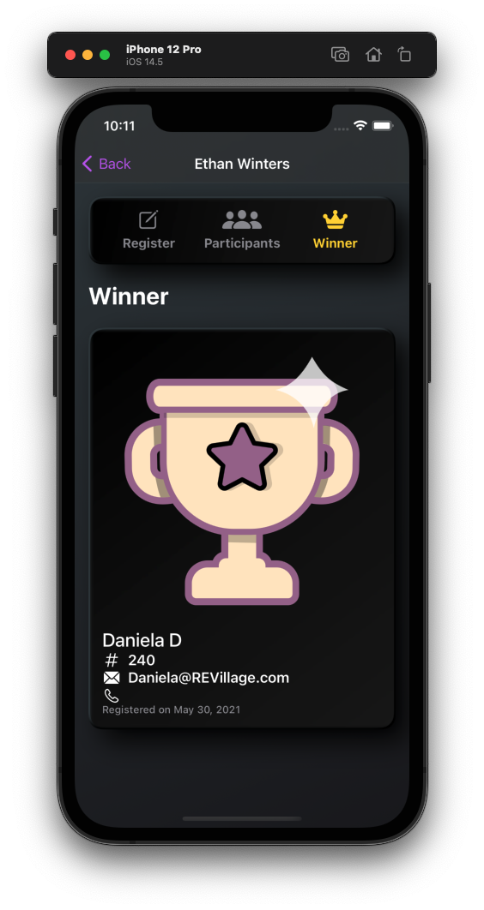 |

| Landscape Light Mode | Landscape Dark Mode
| --- | --- |
|  | 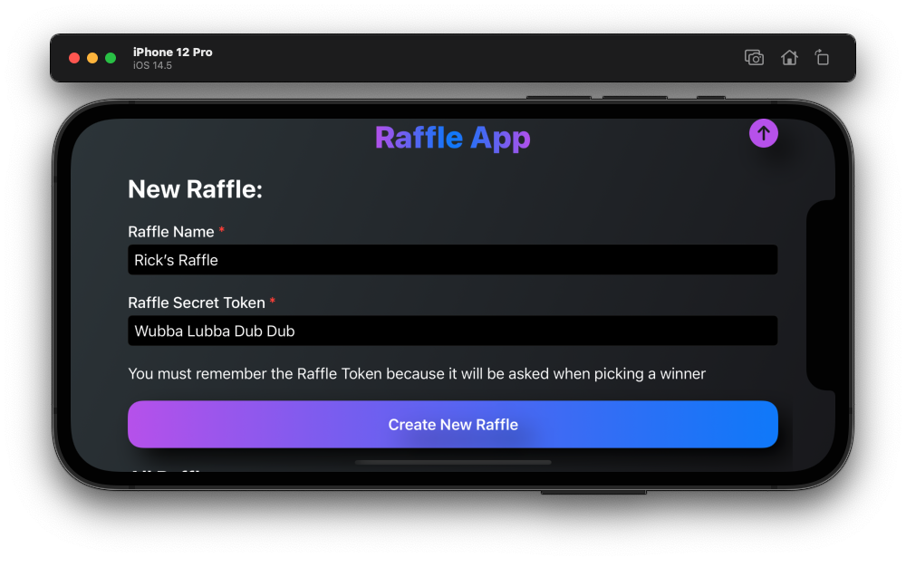 |

### Notes
* Built using XCode 12.5, with a deployment target of iOS 14.5
* XCode 12.5 currently produces a 'Unable to present. Please file a bug.' report on the console.  This is related to the Navigation API.
* No third party dependicies required to run the app.
